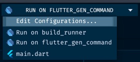

# Contributing to FlutterGen

_See also: [Contributor Covenant Code of Conduct](https://github.com/wasabeef/flutter_gen/blob/main/CODE_OF_CONDUCT.md)_

## Things you will need

 * Linux, Mac OS X, or Windows.
 * Dart
 * Git

## Running the FlutterGen

#### Use as Dart command
To run `pub get` to make sure its dependencies have been downloaded, and use `dart command`.
```sh
$ dart bin/flutter_gen_command.dart --config example/pubspec.yaml
```

#### Use as part of build_runner
```sh
$ cd example
$ flutter packages pub run build_runner build
```

#### Use Intellij




## Running the tests

To run the unit tests:

```
$ pub run test 
```

## Contributing code

We gladly accept contributions via GitHub pull requests.

Please peruse the
[Flutter style guide](https://github.com/flutter/flutter/wiki/Style-guide-for-Flutter-repo) and
[design principles](https://flutter.io/design-principles/) before
working on anything non-trivial. These guidelines are intended to
keep the code consistent and avoid common pitfalls.

To send us a pull request:

* `git pull-request` (if you are using [Hub](http://github.com/github/hub/)) or
  go to `https://github.com/wasabeef/flutter_gen` and click the
  "Compare & pull request" button

Please make sure all your checkins have detailed commit messages explaining the patch.

The tests are run automatically on contributions using GitHub Actions. However, due to
cost constraints, pull requests from non-committers may not run all the tests
automatically.

Once you've gotten an LGTM from a project maintainer and once your PR has received
the green light from all our automated testing, wait for one the package maintainers
to merge the pull request and `pub submit` any affected packages.
